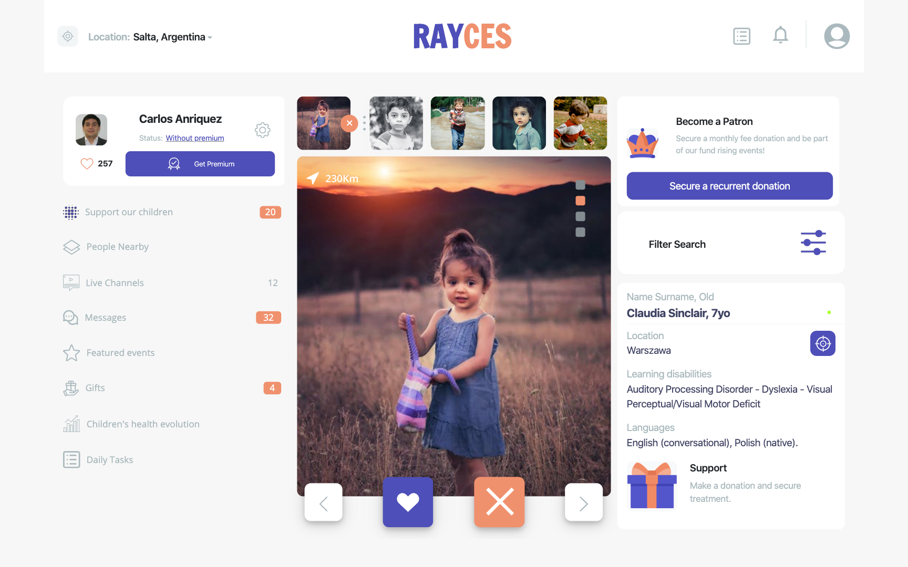

# HTML & CSS CApstone project: Social Network

> The project is about building an HTML & CSS project for a social network site, based on a design design idea by [Vlad Ermakov on Dribbble ](https://dribbble.com/ermalength).

> The original design specification can be found here [Swipex @Behance.net](https://www.behance.net/gallery/70285515/Swipex-This-application-for-dating)

## Social Network Concept.

The original design considers a dating social network.I have used the original design and followed the capstone project challenge to redefine the social network for my solution. 

In my project I considered the concept of servicing a charity branch in a private organization ([Rayces](https://rayces.com)), that offers educational services and medical therapy for children patients with learning disabilities. This company has private patients and my novel idea is that in addition, the organization creates a charity branch that gives free treatment to a small number of children using funds from the private company itself, but also from fund rising campaigns organised by the company. This social network targets to families an individuals that want to donate money to fund the treatment of childre patients. The network gives the chance for the donors to get in touch with the children's tutors, and recieve information about the treatment progres, health checkup updates and chat meessaging contact between the donor and the children's tutor. This network could be also applied to the private patients to get the benefit of a centralised system for tutors to get information about their children treatment progress. 

## Application Engineering - Key Notes

>Main Page responsive strategy.
- Main page has a navbar and footer and a modal box with user information for all mobile screens up to 767px screens.
- For screens bigger than 768, screen would loose its modal box, footprint and the "scroll menu" would appear at the bottom of the image, absolute positioned relative to the main image container.

 >Main page's film reel

- Main page has a film reel with pictures that should be shown in all mobile screens. For this requirement I have used a flex box, that would adjust the bases of each element according to the available space. Each picture has small paddings that ensures a visible gap between them. The small cancel icon shown for the image in focus, has been build with a pseudo code after the image wrap, and absolute positioned relative to the in-focus image wrap. Top and bottom parameter are adjusted depending on the screen sizes. 
- For screens less than 320 px, in-focus image is shown and additional 3 pictures.
- From 320 px to 499 px, in-focus image plus 4 additional pictures.
From 768 px screens onwards, in-focus image and additional 6 pictures are shown in the film reel.

> Using Full Screen Height

Problem: We need each page to contain 100% of the view port's height, so we have a typical app UX.
For this problem, the solution applied was, using 100% of view port's height using flex.
- So, I defined a container, with a display type  flex  with column direction, using a height of 100vh, and making sure I use no margins top or bottom in the container. Any margin at all, would create an overflow that would break the container 100vh definition.
- This solution, allows, for any sub-container to be aligned using flex properties, and making sure all the content would fit in the current viewport's size.

> Main hero image on user pages

Problem: Positioning hero image with a bigger than 50% screen size, but still being able to show the modal box (detail person information) and avoiding breaking when we switch to smaller screens.
Solution: 
- Initially, I was trying to setup a relative image height using vh unit. This although worked , it was really complex to keep without breaking on smaller screens.
- Final solution was to fix header and footer size of the main page, using right icon sizes and padding, while letting the hero image (main image) be adjusted by the flex container.  Also I needed to fix the height of the modal so its relative container does not get shrink when screen size reduces in height for different screen sizes. 
- This solution is simple enough to maintain and does not require additional code at different media sizes.

> Organizing the messages page for media >1024px

- To make the messages page scroll inside the container while in media >1024, I needed to assign to the main page inside the section, a specific size of 62vh, (considering the nab-var height. 
- Also Inside the messages container (msg-frame class), I included the property overflow-y, scroll, and finally made sure all the height parameters in each modal-message (modal-msg) were define as auto, so in that way there is no fix height and the msg-frame would have a all messages placed in order and with the same size one after the other.
- The complete frame would overflow from the main-page section (msg-frame) container), and so, the scroll effect is achieved. 
- Finally I positioned the footer and the menu relative to its parent container and so, it gets rendered in continuation to the main page section with a little 2% offset to compensate for the required margin top and bottom to align the icons.

> Basic Demo Navegability 

- I used Java Script to organise a basic solution. 
- In mobile, main page is sown when chat icon is clicked in the main page.
- From message page we could come back to main page, by clicking the engage icon.
- We can go the detail chat page by clicking any message group on the message page. Currently we go to the same page.
- We go back from chat page to messages page, by clicking the back arrow.
- For screens bigger than 768 a Grid solution is defined and for 768, main-page and user page are shown taking each 50% of the scree width. 
- For screens >=1024 px, 3 greed columns would be created organising Menu-bar, main-page and user page from left to right. 
- If chat option is clicked in the menu, a small Javascript code display=none main page and user page are and instead display-block messages and chat option. So messages and chat should render in the correspondent columns 2 and 3 of the frame for the big screen sizes.
- When user clicks on the "support our children" icon on the menu-bar, the process the the inverse one, and java script would then allow to display=none the messages and chat pages and display=flex the main-page and user-page.
- From PC to mobile: (only for demo purposes) Messages page and chat page gests display=none in the basic mobile.

> Key grid solution to switch from user-layout to message-layout on big screens

Problem: Different layout grid column size configuration shall be managed using the same media query configuration.

General navigability solution:

- When screen is >1024, the links "support our children" and "messages" are detected by a Javascript function and will add the classes layout-message-page and layout-user-page to the #general-layout container correspondently. 
- This classes will modify the current grid-template-column definition to the specific percentage distribution according to the required layout (user or message).   
- At the same time, JS will also display=none all the appropriate section semantics containing the HTML tags for each layout.

## Built With

- HTML5, CSS3, Java Script
- Bootstrap (only containers)
- Visual Code

## Live Demo

[Live Demo Link](https://canriquez.github.io/htmlcss_capstone/)

## Getting Started

- This project is the final project requirement for the HTML_CSS module @Microverse Program.

To get a local copy up and running follow these simple example steps.

- Clone the repository in your local machine

- enjoy

## Authors

👤 Carlos Anriquez

- Github: [@canriquez](https://github.com/canriquez)
- Twitter: [@cranriquez](https://twitter.com/cranriquez)
- Linkedin: [linkedin](https://www.linkedin.com/in/carlosanriquez/)

## 🤝 Contributing

Contributions, issues and feature requests are welcome!

Feel free to check the [issues page](https://github.com/canriquez/htmlcss_capstone/issues).

## Show your support

Give a ⭐️ if you like this project!

## Acknowledgments

- The Corgis @Microverse
- My family

## 📝 License

This project is [MIT](https://opensource.org/licenses/MIT) licensed.